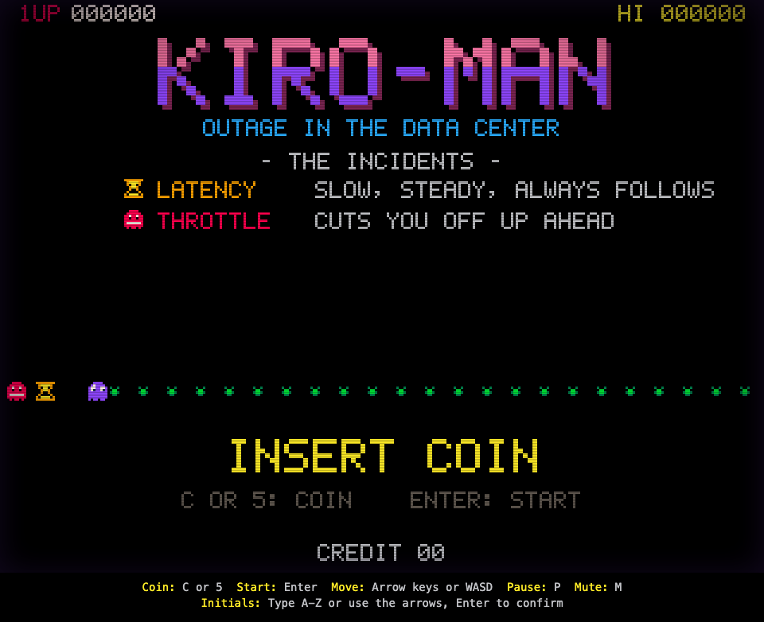
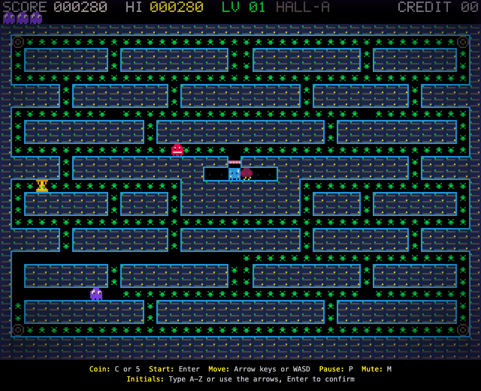
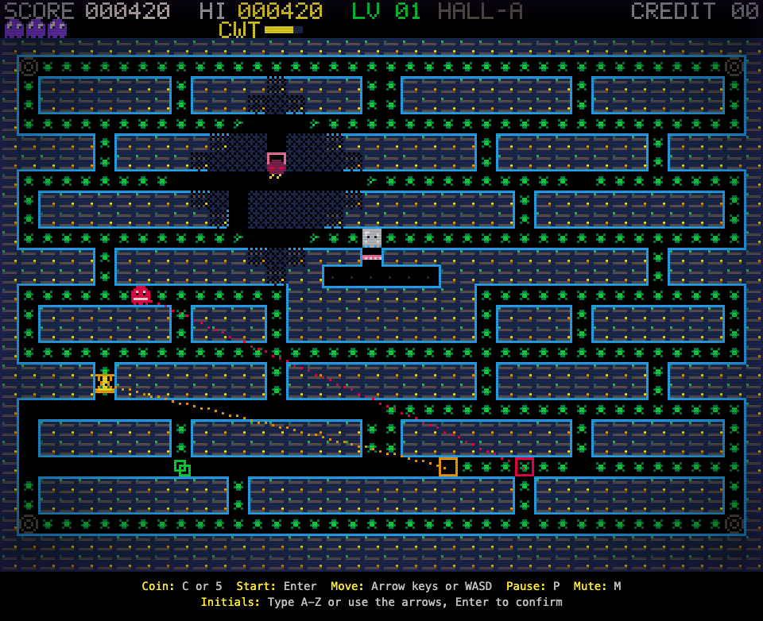
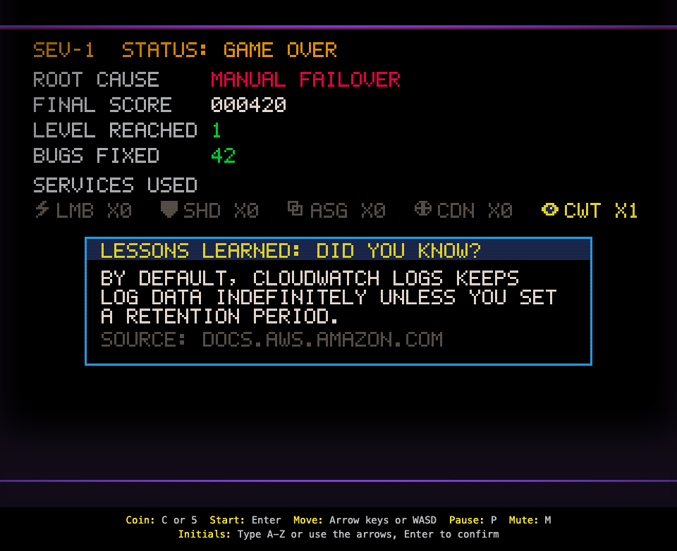
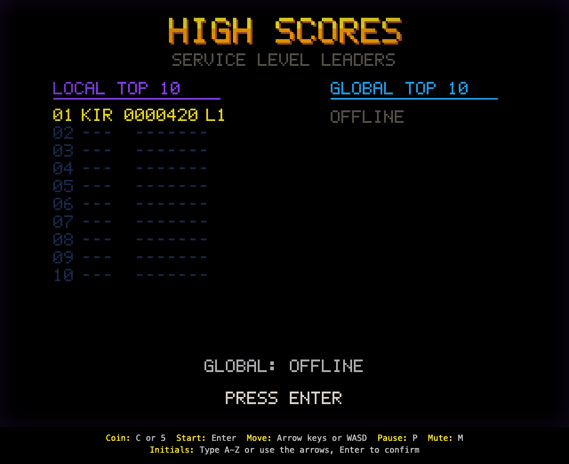

# KIRO-MAN: Outage in the Data Center

A retro coin-op maze chase for the browser. You are the Kiro ghost, fixing bugs in a server-rack data center at 3 AM while four incident-themed enemies hunt you: Latency, Throttle, Cold Start and Outage. AWS services are the power-ups. Insert a coin, survive three lives, read the Incident Report (with a sourced AWS fact) and enter your initials.

The simulation is fully deterministic (seeded PRNG, integer math, fixed 60 Hz tick), so a serverless backend can replay a submitted input log with the same engine code and reject any score it can't reproduce. The repo also packages a Kiro power and an MCP server built on that engine.



| | |
|---|---|
|  |  |
|  |  |

## The game

- Enemies, each with its own AI: Latency (slow BFS pursuit), Throttle (aims 4 tiles ahead of you to cut you off), Cold Start (freezes, then dashes), Outage (random wander that darkens every tile within 4 steps of it).
- Power-ups, each with a timer, a HUD indicator and its own sound:

| Label | Service | Effect | Duration |
|---|---|---|---|
| LMB | AWS Lambda | Faster player (speed 48 instead of 32) | 6 s |
| SHD | AWS Shield | Absorbs the next hit: enemy back to the pen, +200 | 10 s |
| ASG | Amazon EC2 Auto Scaling | Spawns a clone that hunts the nearest bug | 5 s |
| CDN | Amazon CloudFront | The four edge pads warp you to the next pad | 8 s |
| CWT | Amazon CloudWatch | Shows every enemy's target tile and path | 8 s |

- Three original 40x28 halls (HALL-A "us-east-3am", HALL-B "cold aisle", HALL-C "hot aisle"); enemies speed up and leave the pen sooner each level.
- Scoring: bug 10, pickup 50, shield block 200, level clear 500 x level. Three lives, no extra lives, 30-minute shift limit.
- CRT scanlines, KIRO-16 palette, in-code 5x7 pixel font and 8x8 sprites, WebAudio sound effects.

## Controls

| Action | Keys |
|---|---|
| Insert coin | `C` or `5` |
| Start | `Enter` |
| Move | Arrow keys or `W` `A` `S` `D` |
| Pause | `P` (while playing) |
| Mute | `M` |
| Initials | Type `A`-`Z`, or Up/Down to change a letter and Left/Right to change slot; `Enter` confirms |

Browsers only allow audio after a user gesture, so sound starts with your first key press. Safari applies stricter autoplay rules than Chromium.

## Run, test, build

Requirements: Node.js 22, npm 10. Python `uvx` for cfn-lint and the AWS docs MCP server.

```bash
npm install                      # root: game + all tests
npm --prefix infra install       # CDK app
npm --prefix mcp/arcade-operator install

npm run dev                      # Vite dev server
npm run build                    # tsc --noEmit && vite build -> dist/
npm run preview                  # serve dist/ on http://localhost:4173

npm test                         # every test: unit, property (fast-check, 200 runs), static guard
npm run test:unit                # unit tests only
npm run test:pbt                 # property tests only
npm run typecheck
```

QA mode for manual testing: open `/?qa=1&seed=3735928559`. It exposes `window.__KIROMAN_QA__` (`grantPowerUp`, `releaseEnemies`, `setInvulnerable`, `forceGameOver`, `getScreen`, `getScore`, `getLastSubmission`). Any mutator taints the session, so it is never submitted remotely.

### Backend: synth only

```bash
npm run synth                    # cdk synth --quiet -> infra/cdk.out/KiroManStack.template.json
npm --prefix infra test          # stack assertions
npm --prefix infra run typecheck # compiles the shared engine with no DOM lib
npm run cfn-lint                 # uvx cfn-lint==1.57.1 -> docs/cfn-lint-report.txt
```

`KiroManStack` is an HTTP API (throttled `$default` stage, 10 rps / burst 20) in front of a Node 22 Lambda that replays every submission with the browser's engine, a DynamoDB on-demand table, and an S3 bucket behind CloudFront (Origin Access Control) for the site. It synthesizes without AWS credentials; `cdk synth` may print a harmless credentials or notices warning. This project never runs `cdk deploy`: it would create real, billable resources. A `PreToolUse` hook blocks it (see below). `docs/cfn-lint-report.txt` and `docs/power-iac-validation.md` record the template validation results.

### Screenshots (headless browser check)

```bash
npx playwright install chromium  # once
npm run verify:browser           # build, then scripts/screenshots.mjs
```

`scripts/screenshots.mjs` starts `vite preview`, drives headless Chromium through a pinned QA seed and arrow script, and writes `docs/screenshots/01-attract.png` through `08-highscores.png`. It fails on any `console.error`, page error or failed step. After the coin key press it checks that the coin sound actually reaches the audio output (one running AudioContext, master gain > 0, signal measured in front of `destination`). It then exports `mcp/arcade-operator/data/local-scores.json` (the browser's local top 10) and plays a second game with no QA mutators to export `mcp/arcade-operator/data/sample-replay.json`, a real replay for the MCP server. The preview server is always stopped.

## MCP server and power

`mcp/arcade-operator` is a stdio MCP server (`@modelcontextprotocol/sdk` + zod) bundled with esbuild. It imports the same `src/engine`, `src/shared` and `src/leaderboard` code as the game.

| Tool | What it does |
|---|---|
| `get_leaderboard({ source })` | `remote`: `KIROMAN_API_URL/scores` (3 s timeout). `local`: `KIROMAN_LOCAL_SCORES` or `mcp/arcade-operator/data/local-scores.json`. `auto` (default): remote, falling back to local with a note |
| `validate_replay({ seed, inputLog, claimedScore })` | Shared schema, then the Lambda's replay: `{ valid, status, replayedScore, claimedScore, level, ticks }` |
| `list_power_ups()` | The `src/content/services.json` catalog |

Setup:

```bash
npm run build:mcp   # -> mcp/arcade-operator/dist/index.js, copied to retro-arcade-power/server/arcade-operator.mjs
```

The workspace config `.kiro/settings/mcp.json` starts it with `node mcp/arcade-operator/dist/index.js`, relative to the workspace root (Kiro starts workspace MCP servers there). If your Kiro build resolves `args` elsewhere, replace it with the absolute path to `dist/index.js`.

Demo: ask Kiro to "validate the replay in mcp/arcade-operator/data/sample-replay.json". It calls `validate_replay` with that file's contents and returns `valid: true`, `status: "accepted"`.

The packaged power `retro-arcade-power/` bundles four steering guides (determinism, fixed-timestep loop, replay validation, pixel-art canvas), the `deterministic-canvas-games` skill and the bundled server. Install it with the Kiro Powers panel ("add from local folder") or `kiro-cli powers install <absolute path>/retro-arcade-power`. Then replace `${ABSOLUTE_PATH_TO}` in its `mcp.json`. Details and the recorded install are in [retro-arcade-power/README.md](retro-arcade-power/README.md).

## How the seven Kiro features are used

| Feature | Where | How |
|---|---|---|
| Specs | `.kiro/specs/_design-overview.md`, `.kiro/specs/{game-engine,coin-credit-system,leaderboard,arcade-presentation}/{requirements,design,tasks}.md` | EARS requirements, designs with correctness properties, and checkbox task lists, all ticked. The overview's sections 5-9 are binding |
| Steering | `.kiro/steering/tech.md` (always), `game-engine.md` (`src/**/*.ts`), `retro-style.md` (`src/render/**/*.ts`), `aws-content.md` (`src/content/**`) | Stack, commands and "never deploy"; determinism rules with bad/good code; palette and pixel rules; no logos or trademarks, fact sourcing, the disclaimer |
| Hooks | `.kiro/hooks/test-on-save.json`, `synth-on-infra-save.json`, `confirm-deploy.json`, `pbt-after-task.json`; `scripts/confirm-deploy.mjs` (+ `.test.ts`) | Tests on source save; `cdk synth` on infra save; a fail-closed `PreToolUse` gate that answers `permissionDecision: "ask"` and exits 2 on `cdk deploy` (override with `KIROMAN_ALLOW_DEPLOY=1`); property tests after each spec task |
| Property-based testing | `src/**/*.property.test.ts`, `infra/lambda/core.property.test.ts`, `src/test-support/pbt.ts` | Properties P1a-P11 in 13 fast-check test files at 200 runs each: credits, the cabinet reducer, maze reachability, wall invariant, determinism, power-up timers, ranking, replay validation (pure and Lambda), submission schema, initials, facts, integer scale |
| Powers | Used: `aws-infrastructure-as-code` (CDK docs and best practices cited in `infra/lib/kiro-man-stack.ts`; template validation and compliance in `docs/power-iac-validation.md`). Built: `retro-arcade-power/` | The IaC power validated the synthesized template; the packaged power ships both the `POWER.md` + `steering/` and `plugin.json` + `skills/` layouts |
| MCP | `.kiro/settings/mcp.json`, `mcp/arcade-operator/` | `aws-docs` (`awslabs.aws-documentation-mcp-server@1.2.2`) for checking facts; `arcade-operator` for leaderboards, replays and the catalog |
| Custom agents | `.kiro/agents/level-designer.json`, `.kiro/agents/cabinet-tech.json` | A maze designer limited to `npm`/`npx vitest` and the engine steering; a cabinet technician with pre-approved `npm`, `cdk synth/diff` and `git`, MCP and powers, that never deploys without asking |

### In-Kiro checks and what could not be verified

These were attempted from an agent shell on the development machine, not by clicking through the IDE:

- Agents: `kiro-cli agent list` (Kiro CLI 2.27.1) run in the repo lists `cabinet-tech` and `level-designer` as Workspace agents, and `kiro-cli agent validate --path` exits 0 for both files.
- Hook trigger names (A8): the hooks were not created through the hook UI. The installed Kiro IDE agent extension (`Kiro.app/.../extensions/kiro.kiro-agent/dist/extension.js`) defines the trigger names `PreToolUse`, `PostTaskExec` and `PostFileSave` used here, honors `hookSpecificOutput.permissionDecision: "ask"`, and uses the tool name `execute_bash` (the matcher also covers `shell`). The script still exits 2 in case the `ask` payload is not honored.
- Steering inclusion (A9): not observed. Opening `src/engine/rng.ts` in the IDE and checking that `game-engine.md` is listed as included needs the IDE UI. The pattern is a plain glob (`src/**/*.ts`) on purpose.
- Power install: `kiro-cli powers install` on the local folder succeeded (see `retro-arcade-power/README.md`). The IDE Powers panel flow was not clicked through.
- Facts: the `aws-docs` MCP server was not attached to the implementing agent, so each fact in `src/content/aws-facts.json` was checked by fetching its exact `docs.aws.amazon.com` page. The page URL is stored in `sourceUrl`.
- Levels: the three halls were drafted with a throwaway script and checked by the maze properties (P2a/P2b). The `level-designer` agent was not used to author them; it is there for reworking halls.

## Security

The score API is unauthenticated: anyone can `POST /scores`. The mitigations are:

- API Gateway stage throttling (10 requests/s, burst 20);
- a 128 KiB request-body limit in the Lambda (413) and a 10,000-event cap on the input log;
- strict schema validation with field-level errors and no unknown keys (400);
- server-side replay validation: the Lambda replays the seed and input log with the same engine as the browser and stores the score only if it matches exactly (422 `replay_mismatch` otherwise). Forged or edited scores are rejected.

Residual risk: a bot can play a real game and submit it honestly. Replay validation proves that the input produces the score, not that a human typed it.

Hot partition: every score is stored under one partition key (`pk = "GLOBAL"`, sort key = zero-padded score + time + id), so the top 10 is a single descending `Query` with no scan or index. All writes land on one partition, which is fine at arcade-demo volume but would need write sharding for heavy traffic. Ties sort by newest first on the server and by earliest first locally.

The DynamoDB table, S3 bucket and log groups use `RemovalPolicy.DESTROY` because this is a demo stack that is never deployed by this project.

## Repository layout

```
src/engine  src/shared  src/arcade  src/content  src/leaderboard   pure, deterministic (static guard enforced)
src/render  src/audio  src/app                                     browser shell
tests/static                                                       S1 guard + power/config checks
scripts/                                                           confirm-deploy hook, screenshots, cfn-lint
infra/                                                             CDK app (bin, lib, lambda, test)
mcp/arcade-operator/                                               MCP server (src, scripts, data)
retro-arcade-power/                                                packaged Kiro power
docs/                                                              screenshots and validation reports
.kiro/                                                             specs, steering, hooks, agents, settings
```

## Disclaimer

KIRO-MAN is an independent fan project. It is not affiliated with, endorsed by, or sponsored by Amazon Web Services or any video game publisher. AWS service names are used nominatively. No AWS logos or third-party game assets are included.
